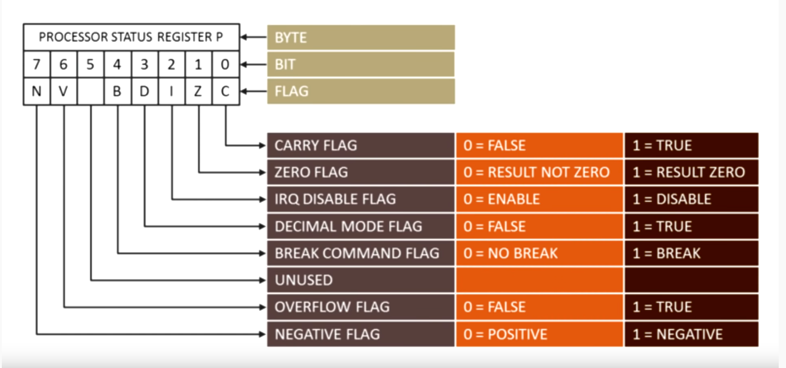

# 6502 Emulator

## Resources
- [first video](https://youtu.be/qJgsuQoy9bc) (just go to the channel or the playlist for the other videos)
- [https://www.obelisk.me.uk/6502/](https://web.archive.org/web/20210912192127/https://www.obelisk.me.uk/6502/) the website it self is shut down.
- [https://sta.c64.org/cbm64mem.html](https://sta.c64.org/cbm64mem.html) and in case it dies of [way back machine version of it]()

## How to use my code and resources

open the video and follow the website contents while taking a look at my notes (after each episode my commits have done with episode _n_ so you can take a look at them at that point) 

## Notes 

These are present in the code

## Code Structure

## Video 1

[https://github.com/davepoo/6502Emulator/tree/2b48db0d0fb41f416f4c1e49f0a2d6df184efa0b](https://github.com/davepoo/6502Emulator/tree/2b48db0d0fb41f416f4c1e49f0a2d6df184efa0b)

proccesor status flags

